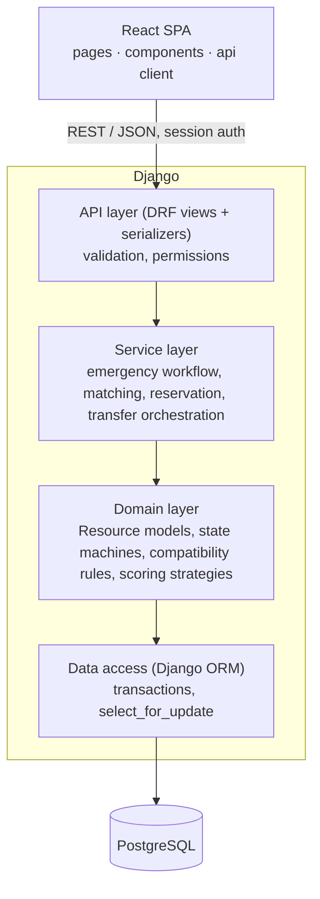

# Architecture

## Scope decision

The team follows the **WBS** as the MVP definition: blood, beds, equipment, operating rooms and
ambulances are all in scope. The proposal's blood-only MVP is the **fallback**: if velocity
falls short, the scope-cut order in [timeline.md](../scrum/timeline.md) applies, and the blood workflow
always survives.

## Layers

Rule of thumb: **views stay thin**. Business rules live in `services.py` and domain classes, so they
can be unit-tested without HTTP.

## Django apps (one per module)

| App | WBS | Owns |
|---|---|---|
| `core` | - | health check, shared base classes/utilities |
| `accounts` | 1.1, 1.2 | `User` (custom, already created), roles, permissions |
| `hospitals` | 1.3 | Hospital, Department/Ward, StorageLocation, Capability |
| `resources` | 2.x | abstract Resource + status state machine; Bed, Equipment, OperatingRoom, Ambulance, Specialist |
| `blood` | 3.x | Donor, Donation, BloodUnit, TestResult, CompatibilityRule, BloodRequest |
| `emergencies` | 4.x | EmergencyCase, RequirementItem, status history, escalation |
| `matching` | 5.x | candidate search, scoring strategies, Reservation, Allocation |
| `transfers` | 6.1, 6.2 | TransferRequest, TransferStatusHistory, ambulance trips |
| `notifications` | 7.1 | Notification, delivery channels |
| `audit` | 8.1 | AuditLog (append-only) |

Apps depend **downwards only**: `matching` may import `blood`/`resources`, but `blood` never imports
`matching`. Cross-module reactions such as notifications and audit go through Django signals or service calls,
not circular imports.

## Key design decisions (fill in as they're made)

| # | Decision | Sprint | Status |
|---|---|---|---|
| ADR-1 | Monorepo: Django REST API + React SPA, Postgres | 1 | Accepted |
| ADR-2 | Custom `accounts.User` model from day one | 1 | Accepted |
| ADR-3 | Shared abstract Resource model for all resource types | 2 | Proposed |
| ADR-4 | Reservations use `select_for_update()` inside `transaction.atomic()` | 7 | Proposed |
| ADR-5 | Matching/scoring as interchangeable strategy classes | 6 | Proposed |
| ADR-6 | Session vs token auth across Vercel/Render domains | 1 | Open |

## To add in Sprint 1

- `erd.png` + source (dbdiagram.io / draw.io) → *Domain model and ERD* task
- Wireframes (Figma link or images) → *UI wireframes* task
- State diagrams for BloodUnit, EmergencyRequest, Reservation, Transfer
