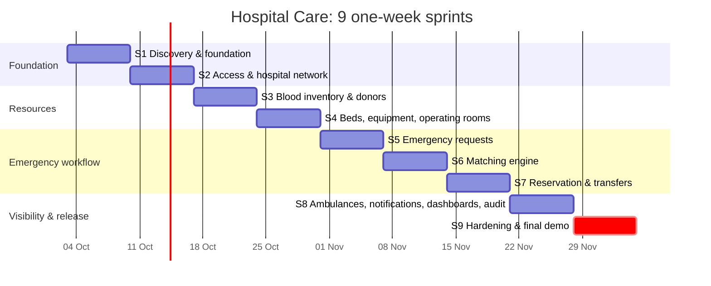

# Release Plan & Timeline

**Start:** Saturday 3 Oct 2026 · **Final demo:** early December 2026 (exact date TBC) · **Sprint length:** 1 week (Sat → Fri)
Ceremonies (review + retro + planning) every **Friday at 22:00 PKT**.

This is a **forecast**. It gets re-checked every Friday against actual velocity. MVP scope follows the
WBS: blood, beds, equipment, operating rooms, emergency requests, matching, transfers, ambulances,
notifications, dashboards and audit. Items marked *(Secondary)* in the WBS are stretch goals.

| Sprint | Dates | Goal | Planned pts | Key outcome to demo on Friday |
|---|---|---|---|---|
| 1 | 3 Oct – 9 Oct | Discovery & foundation | 27 | Repo/CI live, ERD and wireframes, a user can log in |
| 2 | 10 Oct – 16 Oct | Access & hospital network | 32 | Roles enforced, 3 seeded hospitals, audit log working |
| 3 | 17 Oct – 23 Oct | Blood inventory & donors | 24 | Unit moves from collection → tested → available → expired |
| 4 | 24 Oct – 30 Oct | Hospital resources | 25 | Beds/equipment/OR registered, OR booking prevents clashes |
| 5 | 31 Oct – 6 Nov | Emergency requests | 31 | Case created with blood + bed requirements and tracked |
| 6 | 7 Nov – 13 Nov | Matching engine | 32 | Ranked, explained candidates across hospitals |
| 7 | 14 Nov – 20 Nov | Reservation & transfers | 34 | **Core MVP scenario**: reserve → transfer → receive |
| 8 | 21 Nov – 27 Nov | Ambulances, notifications, dashboards, audit | 29 | City command centre, live notifications |
| 9 | 28 Nov – 4 Dec | Hardening & final demo | 14 + stretch | E2E test green, stable staging, final report |

## Milestones that matter

- **End of Sprint 2 (16 Oct):** platform foundation done. If RBAC or the shared resource model slip, every later sprint slips too, so they get top priority.
- **End of Sprint 4 (30 Oct): mid-point check.** All resource types exist. Compare velocity with the plan and cut scope now if needed, not later.
- **End of Sprint 7 (20 Nov):** core MVP scenario works end to end. **This is the minimum we must be able to demo.**
- **Sprint 9:** no new features unless the E2E scenario is green. Spare capacity goes to stretch items.

## Scope cut order (if velocity is lower than planned)

Cut from the bottom of this list first:

1. Secondary items: specialists (2.4), patient transfer (6.3), reports (7.3)
2. Donation appointments (3.1)
3. Multi-resource matching (5.2), falling back to single-resource ranking
4. Ambulance dispatch/trip tracking (6.2), keeping only the registry
5. OR scheduling (2.3), keeping only the registry
6. Distance/travel time (5.1), falling back to listing candidates without distance

**Never cut:** auth/RBAC, blood inventory, emergency request, matching, atomic reservation, transfer, audit.
These make up the MVP acceptance scenario in the proposal (§23).

## Velocity check

| Sprint | Planned | Completed | Notes |
|---|---|---|---|
| 1 | 27 | | |
| 2 | 32 | | |
| 3 | 24 | | |
| 4 | 25 | | |
| 5 | 31 | | |
| 6 | 32 | | |
| 7 | 34 | | |
| 8 | 29 | | |
| 9 | 14 | | |
