# Test Report: Authentication & Role-Based Access Module

| | |
|---|---|
| **Project** | Hospital Care (CityCare), Agile Software Project Management |
| **Module** | Authentication & Role-Based Access (WBS 1.1 Authentication, 1.2 Roles & Permissions) |
| **User stories** | #7 User accounts · #8 Login, logout and session security · #10 Role-based access control |
| **Code** | Branch `haris/frontend` (frontend + backend integrated) |
| **Test cases from** | QA sheet by Muhammad Hassaan (PR #70), adapted to the real system — full catalog: [qa-test-case-catalog.md](qa-test-case-catalog.md) |
| **Date** | 7 October 2026 |

---

## 1. The module

The module controls **who can get in, and what each person can see and do** once they're in.

| Feature | How it works |
|---|---|
| **Sign up** | Patients create their own account. Staff can't sign up: an administrator creates staff accounts. |
| **Sign in** | Email + password. The same message is shown for an unknown email and a wrong password, so accounts can't be discovered. |
| **Lockout** | 5 failed attempts on an account lock it for 15 minutes, even for the right password. |
| **Session** | A secure server-side session cookie, protected against cross-site request forgery (CSRF). Nothing sensitive is stored in the browser. |
| **Roles** | Admin, doctor, nurse, blood bank, pharmacist, patient. Each staff role sees and can change only its own modules. |
| **Protected pages** | Signed-out visitors are sent to sign-in and returned to the page they wanted afterwards (only pages on this site). Patients are kept out of the staff area. |
| **Sign out** | Ends the session on the server. |

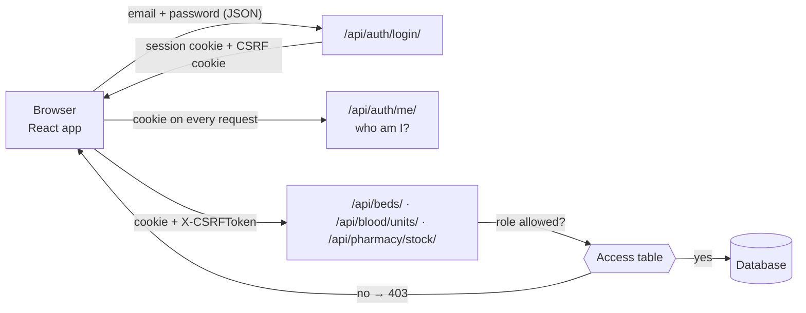

**Access table** (the same rules are enforced by the frontend and the backend):

| Role | Overview | Beds | Blood bank | Pharmacy |
|---|---|---|---|---|
| Admin | view | **edit** | **edit** | **edit** |
| Doctor | view | view | view | view |
| Nurse | view | **edit** | – | view |
| Blood bank | view | – | **edit** | – |
| Pharmacist | view | – | – | **edit** |
| Patient | public pages only | | | |

---

## 2. How it was tested

| Level | What it checks | Tool | Where |
|---|---|---|---|
| **Unit** | Validation rules, redirect safety, access table, API client error handling | Vitest | `frontend/src/**/*.test.ts` |
| **Component / integration** | Real pages rendered with a fake server that follows the backend's rules (roles, 403, 409, 429) | Vitest + Testing Library | `frontend/src/qa/*.qa.test.tsx` and page tests |
| **API** | The real Django API and database: sign-in, lockout, sessions, CSRF, permissions | pytest + Django REST framework | `backend/apps/*/tests/` |
| **End-to-end** | A real browser against the real servers, signed in as each role | Playwright | Screenshots in §5 |
| **Mutation check** | Proves the tests catch bugs: features were broken on purpose to see the tests fail | Vitest | §6 |

Each QA test keeps its original id (TC-xx, LOGIN-Nxx, LAND-Nxx) in its name, so the QA sheet traces straight to code.

**Run the tests yourself:**

```bash
cd frontend && npm test
```

```bash
cd backend && pytest -v
```

---

## 3. Results

| Suite | Tests | Passed | Failed | To do |
|---|---|---|---|---|
| Frontend (all) | 190 | **189** | 0 | 1 |
| ↳ of which QA-sheet cases (`src/qa/`) | 44 | **43** | 0 | 1 (TC-23) |
| Backend (all) | 47 | **47** | 0 | 0 |
| ↳ of which login security (`test_login_security.py`) | 8 | **8** | 0 | 0 |
| End-to-end scenarios in the browser | 14 | **14** | 0 | 0 |

Full output of both runs: [`results/frontend-tests.txt`](results/frontend-tests.txt) and
[`results/backend-tests.txt`](results/backend-tests.txt). Lint, type checks and the production build are also clean.

---

## 4. QA test cases: traceability

PR #70 contained **48 test cases covering 42 QA ids**. They were written against a separate mock app (a "CareLink"
login with *Remember me*, username login, tokens in browser storage, `/dashboard` and `/admin` routes, and roles
named `hospital_staff` / `coordinator`). Merging it would have replaced the real login and landing pages, so every
case was **rewritten against the real system** instead.

**Outcome key:** ✅ passes as specified · 🔁 adapted to how the real system works, then passes · 🆕 the test found a
gap; the feature was added and the test now passes · ⏳ planned for a later sprint · ➖ doesn't apply

### Sign-in: positive cases

| Id | Test case | Outcome | Notes |
|---|---|---|---|
| TC-01 | Login page loads; site entry point | ✅ 🔁 | The site opens on the public page, which links to sign-in (no forced redirect) |
| TC-02 | Logo, fields, button, forgot-password, remember me | 🔁 | All present except *Remember me*: sessions are server cookies (see TC-07) |
| TC-03 | Successful staff login opens the dashboard | ✅ | Staff land on `/staff` |
| TC-04 | Button disabled until both fields filled | 🔁 | Button stays usable and explains what's missing (disabled buttons hide the reason, an accessibility problem); nothing is sent |
| TC-05 | Password masked | ✅ | |
| TC-06 | Show/hide password | ✅ | |
| TC-07 | Remember me stores the session | 🔁 | Session lives in a secure server cookie; the test proves **nothing** is written to localStorage/sessionStorage |
| TC-08 | Valid email accepted | ✅ | |
| TC-09 | Username (no @) accepted | 🔁 | Sign-in is email-only; a username is refused before sending |
| TC-10 | Tab order | 🔁 | Real order: email → password → Show → password help → Log in |
| TC-11 | Enter submits | ✅ | |
| TC-12 | Special characters sent unchanged | ✅ | Password sent exactly as typed, spaces included |
| TC-13 | Forgot-password link | 🔁 | Opens reset instructions (no self-service reset yet) |
| TC-14 | Post-login path by role | 🔁 | Every staff role → `/staff`; patients → home page |
| TC-15 | Session persisted | 🔁 | Cookie session, see TC-07 |
| TC-16 | Responsive layout | ✅ manual | Checked at 375 px and 1280 px, no sideways scrolling (screenshots 13–14) |
| TC-17 | Autofill hints | 🆕 | Email field changed to `autocomplete="username"` so password managers pair it with the password |
| TC-18 | Loading indicator | ✅ | "Logging in…", button disabled while waiting |
| TC-20 | Logout clears session | 🔁 | Sign out ends the session on the server (LAND-N08) |
| TC-21 | Admin login path | 🔁 | Admin → `/staff` with every module |
| TC-23 | Coordinator → emergency request entry | ⏳ | Emergency requests are Sprint 5; kept as a `todo` test |
| TC-29 | Deep-link return after login | ✅ | Also refuses return pages on other websites (open-redirect protection) |
| TC-30 | Login payload has token, role, hospital id | 🔁 | Returns the user and role; no token (cookie session); no hospital id (one hospital per install) |

### Sign-in: negative cases

| Id | Test case | Outcome | Notes |
|---|---|---|---|
| LOGIN-N01 | Unknown email → generic message | ✅ | |
| LOGIN-N02 | Wrong password → same message | ✅ | |
| LOGIN-N03 | Lockout after repeated failures | 🆕 | **Gap found.** Added: 5 failures lock the account for 15 min (backend + message in the UI). Counted per account, not per IP, because hospital computers share one address |
| LOGIN-N04 | SQL injection handled safely | ✅ | Refused as a malformed email in the browser; the API test sends 3 injection payloads: no login, no data change |
| LOGIN-N05 | XSS input shown as text | ✅ | React escapes all text; the test checks no script runs |
| LOGIN-N06 | Empty fields blocked | ✅ | Email only, password only, and both |
| LOGIN-N07 | Deactivated account → dedicated message | 🔁 | Deactivated accounts can't sign in and get the **generic** message, so the system never confirms an account exists |
| LOGIN-N11 | Password masked | ✅ | Same test as TC-05 |
| LOGIN-N12 | Email case/spaces; password untouched | ✅ | Email trimmed and matched case-insensitively; password unchanged |
| LOGIN-N14 | Oversized input refused | 🆕 | **Gap found.** Added limits (email 254, password 512) in the browser and the API |
| LOGIN-N15 | Only email + password sent | ✅ | The browser can't choose a role or hospital |

### Staff workspace (the QA sheet's "landing dashboard")

| Id | Test case | Outcome | Notes |
|---|---|---|---|
| LAND-N01 | Signed-out users kept out | ✅ | Sent to sign-in, then back to the requested page |
| LAND-N02 | Data from another hospital | ➖ | One hospital per installation, so there's no other hospital's data to leak |
| LAND-N03 | Restricted areas hidden from staff | 🔁 | Modules outside the role are hidden, **never loaded**, and blocked if opened by address |
| LAND-N04 | Error shown per widget | ✅ | A failing ER feed shows its own message while the rest works |
| LAND-N06 | Navigation links lead to real pages | ✅ | `/staff`, `/staff/beds`, `/staff/blood`, `/staff/pharmacy` |
| LAND-N07 | Stored XSS shown as text | ✅ | HTML in server data (a ward name) is displayed, never run |
| LAND-N08 | Logout leaves no usable session | ✅ | Coming back afterwards asks for sign-in again |
| LAND-N09 | Zero counts show as 0 | ✅ | Never blank or NaN |

**Helper-only cases.** The PR also unit-tested two helpers from the mock app (`normalizeEmail`, `escapeHtml`). The
real system doesn't need them: React escapes output, and email normalisation is covered by LOGIN-N12.

---

## 5. Test cases in action (real servers, real browser)

Captured with Playwright against the running frontend and backend, using the demo accounts from `seed_demo`.

| | |
|---|---|
| 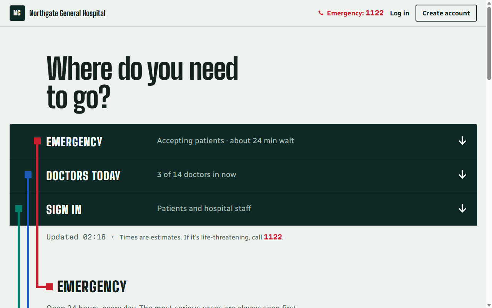 **01 · TC-01** The site opens on the public page with live ER status and a sign-in link. | 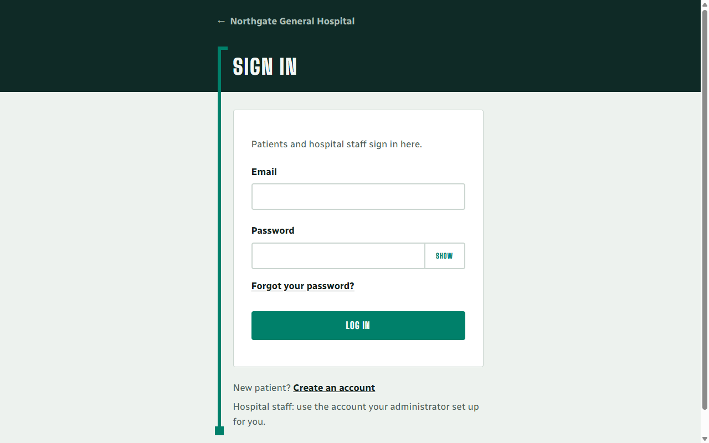 **02 · TC-01/02** The sign-in page. |
| 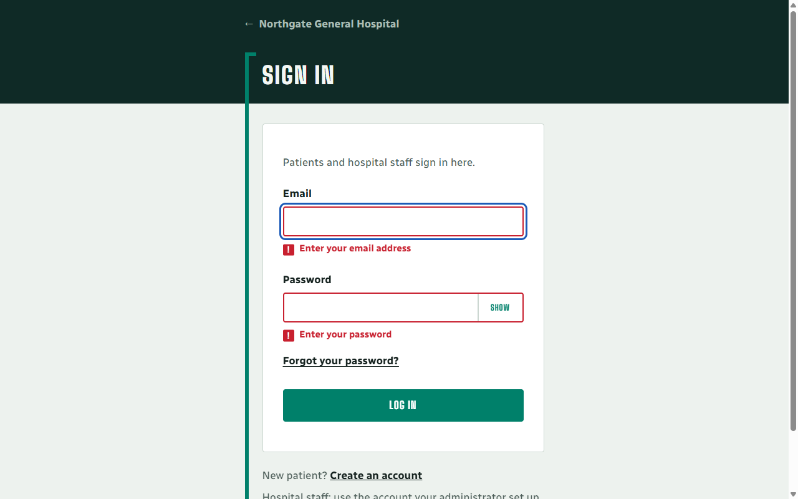 **03 · TC-04, LOGIN-N06** Empty form: each field says what's missing; nothing is sent. | 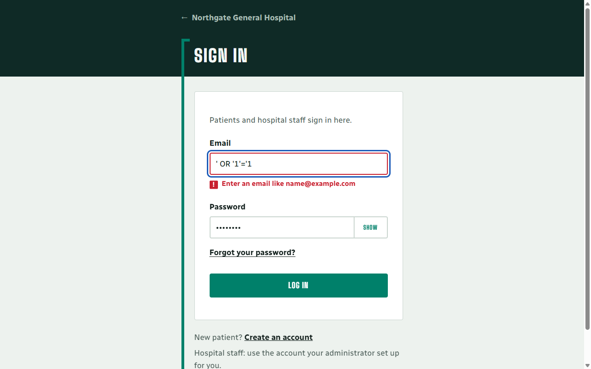 **04 · LOGIN-N04** An SQL-injection string is refused as a malformed email. |
| 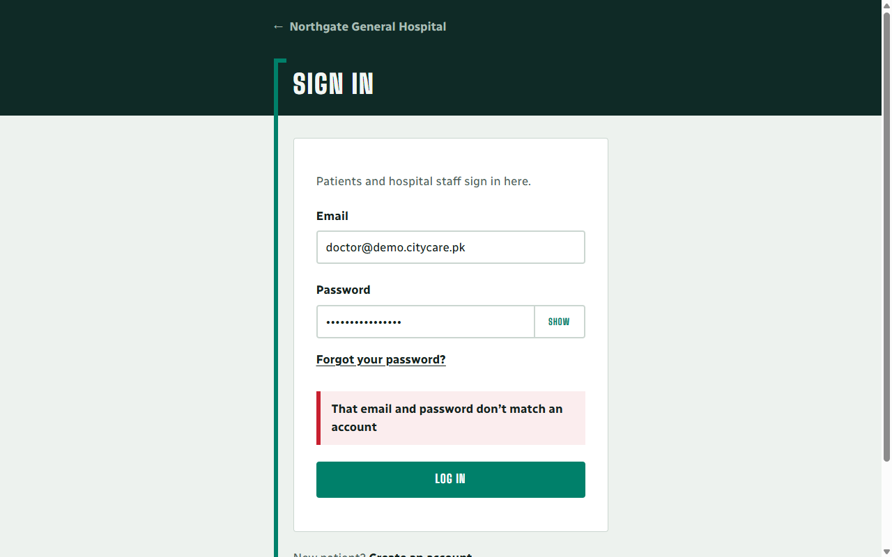 **05 · LOGIN-N01/N02** Wrong password: the generic message. | 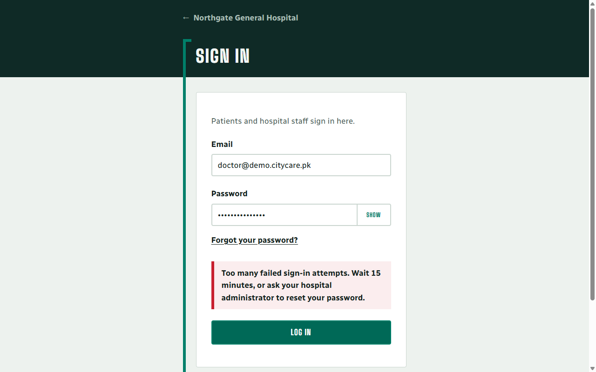 **06 · LOGIN-N03** After 5 failures, even the **correct** password is refused for 15 minutes. |
| 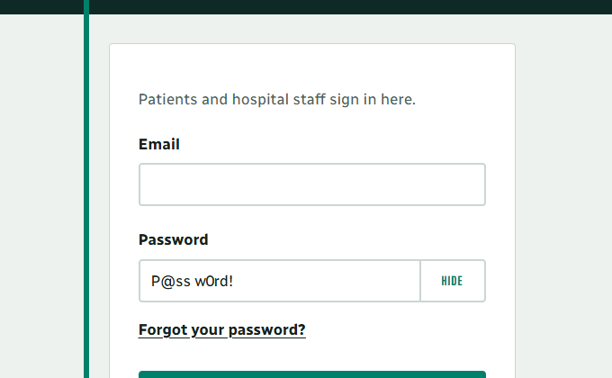 **07 · TC-06** Show reveals the password. | 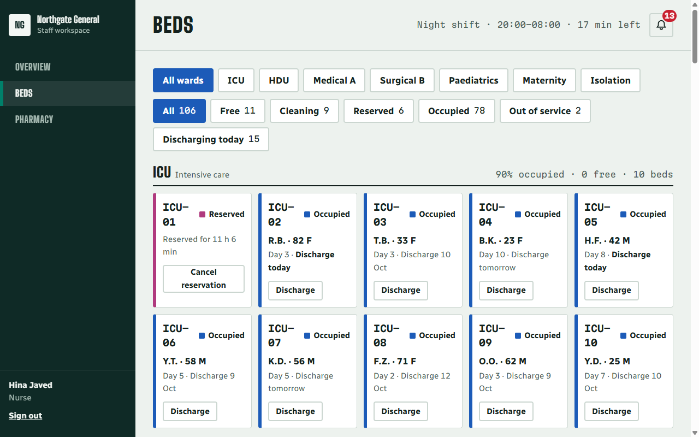 **08 · LAND-N01, TC-29** A signed-out visit to `/staff/beds` went to sign-in, then back to the bed board. Nurse menu: Overview, Beds, Pharmacy. |
| 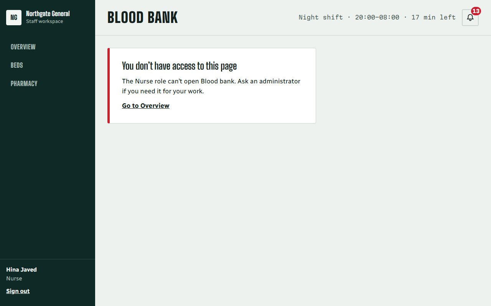 **09 · LAND-N03** The nurse opens the blood bank by address: no access. |  **10 · LAND-N08, TC-20** After signing out: back at sign-in. |
| 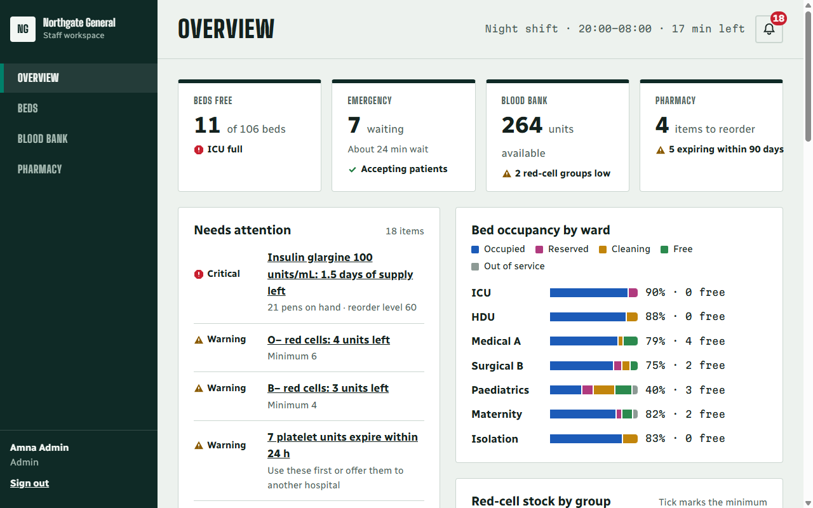 **11 · TC-21** The admin sees every module. | 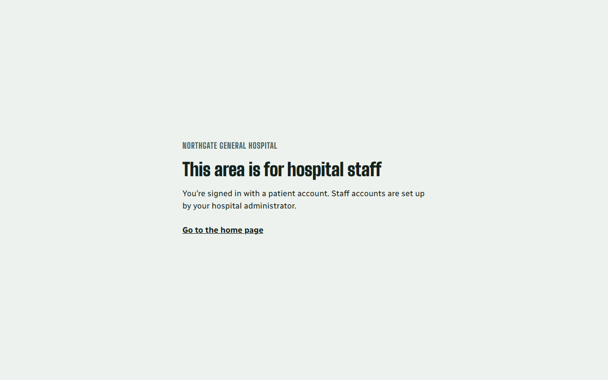 **12 · TC-14** A patient is kept out of the staff area. |
| 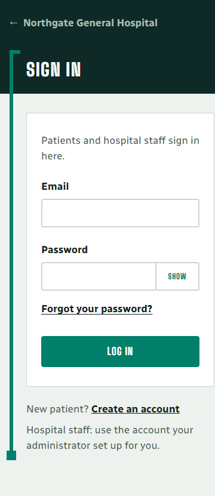 **13 · TC-16** Sign-in at phone width (375 px). | 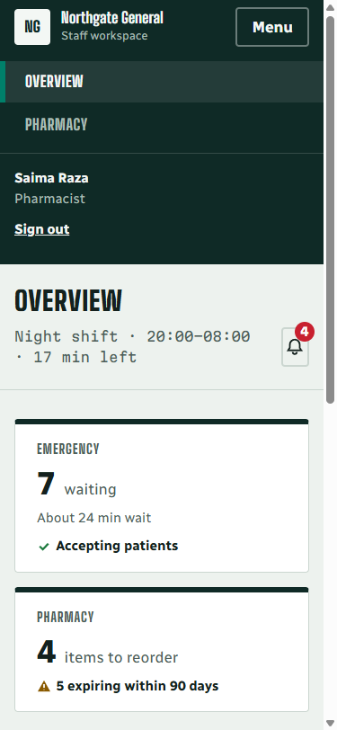 **14 · TC-16** The staff workspace on a phone, menu open. No sideways scrolling. |

---

## 6. Do the tests actually catch bugs? (mutation check)

Tests that pass prove little unless they fail when the code is wrong. Two security features were **broken on
purpose**, the QA suite was run, and the code was restored:

| Deliberate bug | Caught by | Result |
|---|---|---|
| Return page after sign-in allowed to be another website | TC-29 "the return page must be on this site" | ❌ failed as expected (33 passed, 1 failed) |
| Email length limit removed | LOGIN-N14 "oversized input is refused" | ❌ failed as expected (33 passed, 1 failed) |

With the code restored, all tests pass again.

---

## 7. Defects found during testing

| # | Found by | Defect | Fix |
|---|---|---|---|
| 1 | LOGIN-N03 | No protection against password guessing (also an acceptance criterion of story #8) | Account lockout: 5 failures → 15 minutes; message in the UI |
| 2 | LOGIN-N14 | No input length limits | Limits in the browser and the API (before the password hasher runs) |
| 3 | TC-17 | Email field marked `autocomplete="email"` | Changed to `username` |
| 4 | Integration testing | Staff pages loaded every module for every role, so the server's 403 for e.g. a nurse reading blood stock broke the whole workspace | Each role loads only its modules |
| 5 | Integration testing | Blood units sorted by expiry as *text*, wrong with the API's mixed time formats | Compare real times |
| 6 | Integration testing | The bed page announced a change before the server confirmed it | Announce only after the server accepts; show conflicts (409) clearly |

---

## 8. Limitations

- **Lockout counts live in the server's memory.** That's fine for one server. With several servers, use a shared
  cache (e.g. Redis) so the count is shared and survives restarts.
- **No self-service password reset yet.** Staff ask their administrator; patients ask the front desk.
- **TC-23** waits for the emergency-request module (Sprint 5). **LAND-N02** doesn't apply to a one-hospital install.
- Database-specific behaviour on PostgreSQL (e.g. row locking) runs in CI; local runs use SQLite.

---

## 9. Demo script for the presentation

1. Start the backend and load the demo data:

   ```bash
   cd backend && python manage.py migrate && python manage.py seed_demo && python manage.py runserver
   ```

2. Start the frontend in a second terminal:

   ```bash
   cd frontend && npm install && npm run dev
   ```

3. Open http://localhost:5173 and walk through:
   1. **Public page → Log in** (TC-01).
   2. **Submit empty**, then **type `' OR '1'='1`** as the email (TC-04, LOGIN-N04).
   3. **Wrong password** with `doctor@demo.citycare.pk` (LOGIN-N01), repeat 5 times, then use the right password
      to show the **lockout** (LOGIN-N03). Restart the backend to clear it.
   4. Open **http://localhost:5173/staff/beds** while signed out: sign-in appears; sign in as
      `nurse@demo.citycare.pk` and you're back on the bed board (LAND-N01, TC-29).
   5. Show the nurse's menu; open **/staff/blood** to show **no access** (LAND-N03). Discharge a bed to show role
      permissions working end to end.
   6. **Sign out** (LAND-N08), sign in as `admin@demo.citycare.pk` to show every module (TC-21), then as
      `patient@demo.citycare.pk` and try `/staff` (TC-14).
4. Run the tests live: `npm test` in `frontend` and `pytest -v` in `backend`.

The demo password for all accounts is in [`docs/architecture/api.md`](../architecture/api.md#demo-data).
